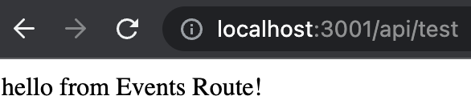
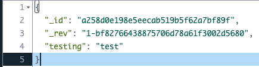

# How to make a Tradelens Webhook

## Step 0 - Setup Your Project (Typescript isn't required)
To get started, create a new folder named node_project and move into that directory:
1. `mkdir node_project`
2. `cd node_project`
3. Next, initialize it as an npm project: `npm init -y`
4. Install TypeScript: `npm i typescript`
5. Create tsconfig.json to configure the compiler options: `touch tsconfig.json`
6. Paste the below JSON into your tsconfig.json file:
```
{
    "compilerOptions": {
    "module": "commonjs",
    "esModuleInterop": true,
    "target": "es6",
    "moduleResolution": "node",
    "sourceMap": true,
    "outDir": "dist",
    "skipLibCheck": true
    },
    "lib": ["es2015"] 
}
```
## Step 1 - Create Express Server
1. Install express:  
`npm i express`  
`npm i @types/express`
2. `mkdir src`
3. `touch src/app.ts`
4. Paste the below code into your app.ts:
```
import express from "express";
import eventRoute from "./routes/event-route";

const app = express();

// middleware
app.use(express.json());
app.use(express.urlencoded({ extended: true }));

app.use("/api", eventRoute);

const port = 3001;
app.listen(port, () => {
  console.log(`Server listening on port ${port}`)
});
```
5. `mkdir src/routes`
6. `touch src/routes/event-route.ts`
7. Past the below code into your event-route.ts:
```
import express from "express";

const router = express.Router();

router.get('/test', (req, res) => {
    res.status(200).send("hello from Events Route!");
});

export default router;
```
8. Start your server by running:  
`npx tsc`  
`node dist/app.js`
Your console should read as: **Server listening on port 3001**
9. Verify your server is up and running by visiting http://localhost:3001/api/test


## Step 3 - Create IBM Cloudant Database
We will be using IBM's free tier Cloudant NoSQL DB to store incoming events from Tradelens.

1. Create an account on [IBM Cloud](https://cloud.ibm.com/) and login.
2. Search for Cloudant under *Resources and Products* and keep all the default settings for a **Lite** Plan and click create.

## Step 4 - Integrate IBM Cloudant Database with Node Server
1. Once your DB is created, you should be able to see your DB under: **Resource list -> Services and Software**. Copy the **External endpoint (preferred)** url as we will use this shortly.
2. Create an API key by going to **Manage -> Access (IAM -> API keys** and copy the key you create as we will need this as well.
3. Back in in the root directory of your node project run: `touch .env`
4. Edit your .env file with the below (replacing the CLOUDANT_URL and CLOUDANT_APIKEY values with your own):
```
CLOUDANT_URL=replace_with_your_url
CLOUDANT_APIKEY=replace_with_your_apikey
```
5. Install the dotenv dependency so we can reference these environment variables: `npm i dotenv`
6. Add this line to the top of your app.ts file: `require('dotenv').config();`
7. Replace your /routes/event-route.ts file contents with the below:
```
import express from "express";
import { CloudantV1 } from '@ibm-cloud/cloudant';
import { IamAuthenticator } from 'ibm-cloud-sdk-core';

const router = express.Router();

// set cloudant connection
const authenticator = new IamAuthenticator({ apikey: process.env.CLOUDANT_APIKEY });
const service = new CloudantV1({ authenticator: authenticator });
service.setServiceUrl(process.env.CLOUDANT_URL);

router.get('/test', (req, res) => {
    res.status(200).send("hello from Events Route!");
});

router.get('/lastTenEvents', (req, res) => {
    service.postAllDocs({
        db: 'tradelens-subscription-events',
        includeDocs: true,
        limit: 10
      }).then(response => {
        res.status(200).send(response.result);
      });
});

router.get('/allEvents', (req, res) => {
  service.postAllDocs({
      db: 'tradelens-subscription-events',
      includeDocs: true,
    }).then(response => {
      res.status(200).send(response.result);
    });
});

router.post('/events', (req, res) => {
    res.status(200).send("Event received successfully!");

    req.body.forEach(event => {
      service.postDocument({
        db: 'tradelens-subscription-events',
        document: event
      });
    });    
})

export default router;
```
8. Install IBM Cloudant dependencies from the root directory:  
`npm i @ibm-cloud/cloudant`  
`npm i ibm-cloud-sdk-core`
9. Rebuild your server and run it:  
`npx tsc`  
`node dist/app.js`
10. Test your new cloudant endpoint with the postman collection:
[Local - Send Event](./postman_collection)
11. After running the Send Event POST request your Cloudant Database Dashboard should show an entry similar to:


## Step 5 - Dockerize Your Application and Push to ICR
1. Install dependent software:
- [Docker](https://docs.docker.com/engine/install/)
- [IBM CLI](https://cloud.ibm.com/docs/cli?topic=cli-install-ibmcloud-cli)
2. Follow this [Quick Start Guide](https://cloud.ibm.com/registry/start) for IBM Container Registry
3. Make sure you have docker installed of course. The dockerfile within this directory should work just fine for this exercise but feel free to review/update as needed.
2. Build your image from your root directory: `docker build -t your_project:v1 .`
3. Tag your image: `docker tag your_project:v1 icr.io/your_namespace/your_repository:v1`
4. Login to IBM CLI: `ibmcloud login`
5. Set your cr region: `ibmcloud cr region-set global`
6. Login to ICR: `ibmcloud cr login`
7. Push image to ICR: `docker push icr.io/your_namespace/your_repository:v1`
## Step 6 - Deploy to IBM Cloud
1. Create a [CodeEngine project](https://cloud.ibm.com/codeengine/overview) which points to your pushed image in ICR.
2. Under configuration create a registry access secret:
- Registry Source: **Custom**
- Registry Name: **< YourRegistry >**
- Registry Server: **"icr.io"**
- Username: **"iamapikey"**
- Password: **< yourapikey >**
- Email: **Your IBM Cloud Email**
3. Listening port should be set to what you have in your app.js / dockerfile (3001)
4. Under environment variables add the two variables we have in our project's .env file.
5. Click **Save and Create** to deploy
6. Click **Test Application -> Application URL** to get your hosted server's URL endpoint. This will act as our Webhook.
7. Verify that your Cloudant DB receives an event when running the WebHook PerformTest POST request from the [Postman Collection](./postman_collection/) (you will have to replace the environment, organizationId, and your endpoint variables when running the requests).
## Step 7 - Create Tradelens Webhook Subscription
1. Login to Tradelens
2. Follow this click path to create a subscription: **Account -> Subscriptions -> Create New Subscription -> Organization Subscription**
3. Enter a Name, Set URI equal to https://your_apps_endpoint/api/events, and select a set of event types to receive.
4. Sit back and watch your Cloudant DB receive events :)
